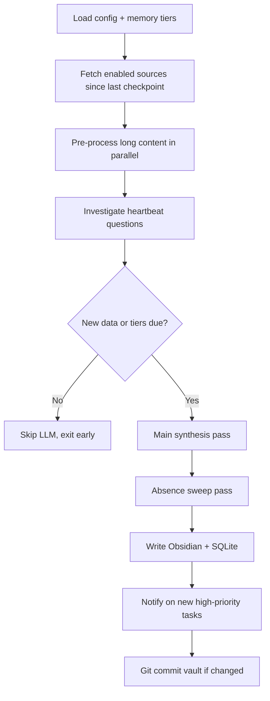

# Work Assistant — How It Works

This is a product-level description with enough technical detail to understand what the agent does, why it's structured this way, and how the pieces fit together. For install steps see [SETUP.md](SETUP.md). For config keys see [README.md](README.md).

---

## What it is

Work Assistant is a **personal chief-of-staff agent** that runs on your laptop. It polls the systems where your work actually happens — Slack, Gmail, JIRA, Confluence, Google Calendar/Meet, and your Obsidian vault — synthesizes overlapping signals into a single prioritized picture, and writes structured output back to Obsidian.

It is not a chatbot you visit. It is a **background process** you schedule (four times on weekdays, by default) plus two on-demand tools:

| Tool | When it runs | What you get |
|------|--------------|--------------|
| **`main.py`** | Scheduled (launchd / Task Scheduler) | Updated task list, memory tiers, decision/experiment log entries, people trajectories |
| **`ask.py`** | On demand (Raycast, terminal) | Plain-text answer to a specific question, searched across your sources |
| **`meeting_brief.py`** | Every ~5 minutes | Pre-meeting note in Obsidian + desktop notification before calendar events |

The Obsidian vault is the **human-readable surface**. SQLite (`state.db`) is the **operational brain** — last-checked timestamps, open tasks, embeddings, meeting-brief deduplication, usage metrics.

---

## The core problem

Modern PM/engineering work generates **the same signal in five places**. A ticket moves, an email fires, someone Slacks about it, a Confluence page gets edited, and the topic comes up in a standup transcript. That is one event, not five todos.

Work Assistant's main synthesis pass is designed to **collapse that noise**: deduplicate across sources, prioritize what actually needs your attention, draft cross-system handoff messages when appropriate, and maintain analytical context so the next run starts smarter than the last.

A second pass — the **absence sweep** — looks for the opposite problem: things that *should* be showing up but aren't (stale tickets, unanswered threads, missing follow-ups).

---

## End-to-end run (`main.py`)

Each scheduled run follows the same pipeline:



### 1. Fetch

Each source connector returns items **since its last successful checkpoint** (stored in `state.db`). Sources are independently enableable in `config.yaml`:

- **Slack** — recent messages, DMs, mentions (browser-session tokens)
- **Gmail** — unread mail matching your query filter (OAuth)
- **JIRA / Confluence** — tickets and pages matching JQL/CQL (API token)
- **Meetings** — calendar events + transcript/notes content (OAuth)
- **Obsidian** — recently modified files in `watch_folders` (local filesystem)

If a connector fails (expired token, VPN down), the run continues with whatever succeeded.

### 2. Pre-process (parallel LLM passes)

Long raw content is expensive to stuff into the main prompt. Before synthesis, the agent runs **targeted mini-passes**:

- **Obsidian notes** over ~1,500 chars → summarized in parallel (`gpt_processor.summarize_notes`)
- **Slack threads** → conversation-level synthesis
- **Meeting documents** → per-doc extraction of decisions, action items, dynamics

These use the same LLM backend as the main pass (Anthropic, OpenAI, or Ollama). Local models work fine here; the main pass benefits from a stronger cloud model because it emits large structured JSON.

### 3. Heartbeat investigation

Before the main LLM call, the agent reads **`agent-memory/heartbeat.md`** — a markdown checklist of standing questions you maintain:

```markdown
- [ ] Has the team responded to my API proposal?
- [x] Did we ship the hotfix?   ← checked items are skipped
```

For each unchecked item, it extracts search keywords (expanding nicknames via `people.yaml`), then searches **Slack, Gmail, JIRA, Confluence, meeting notes, and the semantic decision/experiment index** in parallel. Findings are bundled into the main prompt so the model can assess: answered, partial, or still no signal.

This is proactive investigation you would otherwise do manually every morning.

### 4. Main synthesis pass

Everything flows into one large prompt built from `templates/system_prompt.md` plus injected domain rules, memory context, open tasks, resolved-task history, experiment/decision log excerpts, and heartbeat findings.

The model returns structured output:

| Output | Destination |
|--------|-------------|
| **Tasks** | SQLite (source of truth) → rendered to `tasks.md` |
| **Memory tier updates** | Rewritten wholesale in `daily.md` … `quarterly.md` |
| **Decision entries** | Appended to `decisions.md` + embedded for search |
| **Experiment entries** | Appended to `experiments.md` + embedded for search |
| **People trajectory updates** | Written back to `people.yaml` |

The system prompt defines four jobs: surface attention items, update memory, log experiments, log decisions. See `templates/system_prompt.md` for the full behavioral spec.

### 5. Absence sweep (second pass)

After the main pass, a separate prompt (`templates/absence_prompt.md`) receives the task list so far plus rosters of people who appeared in Slack, email, and meetings. It looks for **gaps** — commitments without follow-through, expected updates that never arrived, cross-system drift.

Absence hits arrive as tasks (often high priority, tagged in sources). They merge into the same task reconciliation flow.

### 6. Write + notify

- Memory tiers due this run get rewritten.
- Tasks upsert into SQLite; tasks not seen this run are marked stale.
- `tasks.md` is regenerated from the DB (not append-only — the model replaces the full list each run, minus items you've checked off).
- New **high-priority** tasks that weren't open before this run trigger a desktop notification (macOS `osascript` or Windows toast).
- Decision/experiment entries append to their logs and get embedded locally.
- Source checkpoints advance only after a successful write.
- If the vault is a git repo, changes auto-commit with a timestamp.

### Early exit

If there is no new source data, no heartbeat questions, and no memory tiers due, the run **skips the LLM entirely**. This keeps scheduled runs cheap on quiet days.

---

## The memory cycle

Memory lives in **`agent-memory/`** inside your Obsidian vault as markdown files the agent rewrites. The design goal: each run starts with **compressed analytical context** instead of re-reading weeks of raw Slack.

### Tier structure

| Tier | File | Updated when | Content character |
|------|------|--------------|-------------------|
| **Daily** | `daily.md` | Every run | What's active right now — open threads, today's decisions |
| **Weekly** | `weekly.md` | Last run of the day (≥ 4:30 PM) | How today fits the week's trajectory |
| **Sprintly** | `sprintly.md` | Friday last run | Sprint arc: shipped, slipped, blocked, team dynamics |
| **Monthly** | `monthly.md` | Last Friday of the month | Patterns, goal progress, quietly emerging problems |
| **Quarterly** | `quarterly.md` | Last Friday of quarter-end months (Mar/Jun/Sep/Dec) | Strategic shifts, OKR progress, lessons |

Synthesis happens at the **end** of each cycle so the **next** run reads fresh summaries.

The guiding principle from the system prompt: **contextualize downward, synthesize upward**. Daily memory should reference quarterly stakes; quarterly memory compresses granular detail into patterns.

Memory files deliberately **do not** duplicate the task list. Tasks live in `tasks.md`; memory captures dynamics, context, and trajectory.

### Staleness catch-up

Calendar triggers can be missed (laptop asleep, VPN down, LLM error at exactly 4:30 PM on a Friday). Each tier has a **staleness threshold** — if `weekly.md` hasn't been touched in 36 hours, or `sprintly.md` in 9 days, etc., the tier refreshes on the next successful run regardless of the clock. Missed windows self-heal.

### Timezone

All tier scheduling uses the IANA timezone from `config.yaml` (`agent.timezone`). The 4:30 PM weekly/sprintly trigger is local time, not UTC.

---

## Tasks: DB ↔ Obsidian feedback loop

Tasks use a **dual-layer** design:

1. **SQLite** holds structured task rows (id, priority, context, sources, links, timestamps, status).
2. **`tasks.md`** is a rendered view you edit in Obsidian.

At the start of each run, the agent reads `tasks.md` for **checked items** (`- [x]`). Those titles resolve tasks in the DB before synthesis begins, so the model doesn't re-surface work you've already dismissed.

You check off tasks in Obsidian; the agent respects that on the next run. The model still produces a full replacement list each time — merging old and new, dropping resolved items, preserving `first_seen` timestamps for carried-over work.

---

## Permanent knowledge logs

Unlike memory tiers (rewritten), **decisions** and **experiments** are **append-only** logs:

- `decisions.md` — commitments, direction changes, reversals (with durability: standing vs scoped)
- `experiments.md` — concluded A/B test results with learnings and constraints

These grow without bound, so they are **not** loaded in full on every question or run. Instead:

### Local semantic search (`embeddings.py`)

Each new log entry is embedded with **`all-mpnet-base-v2`** (sentence-transformers, runs fully offline after first download). Vectors live in SQLite alongside `state.db`. Search is brute-force cosine similarity in numpy — appropriate for hundreds to low thousands of entries.

Semantic search is used in:

- **Main pass** — surface related past decisions before logging duplicates
- **Heartbeat** — find older decisions relevant to a standing question
- **`ask.py`** — pull the 8 most relevant decision/experiment entries for the question
- **`meeting_brief.py`** — find past decisions/experiments related to the meeting title

This keeps retrieval fast and local without depending on an embedding API.

---

## People directory

`people.yaml` is your org chart for the agent: names, nicknames, emails, Slack IDs, roles, and **trajectory** notes (how the relationship is evolving).

Uses:

- **Heartbeat** expands "Has Alex responded?" → searches full name
- **Meeting briefs** show attendee trajectories
- **Main pass** can update trajectories when new interpersonal signals appear
- **Slack auto-discovery** adds unknown message senders to `people.yaml` over time

Trajectories are short analytical notes the model maintains — not CRM fields.

---

## On-demand Q&A (`ask.py`)

`ask.py` is the interactive layer. You ask a question; it:

1. Searches all enabled sources in parallel (same heartbeat search machinery)
2. Loads all memory tier files in full (they're small and always current)
3. Semantically retrieves relevant decision/experiment entries
4. Calls the LLM with `templates/ask_prompt.md`
5. Prints plain text to stdout
6. Appends the Q&A to `inbox/ask-YYYY-MM-DD.md` for your records

Logging is suppressed so stdout stays clean for launcher integrations.

### Raycast extension

`raycast_ask.sh` is a Raycast Script Command. The header comments register it with Raycast:

```bash
# @raycast.title Ask Knowledge Base
# @raycast.argument1 { "type": "text", "placeholder": "Ask a question..." }
```

**Setup:** In Raycast → Extensions → Script Commands, add `raycast_ask.sh` (or symlink it). Raycast passes your query as `$1`; the script `cd`s to the agent directory and runs `python3 ask.py "$1"`.

**Requirements for Raycast to work reliably:**

- Python path must resolve (use the venv's python in the script if system `python3` lacks dependencies)
- `.env` must be loaded — either export keys in your shell profile, or extend `raycast_ask.sh` to `source .env` before calling Python
- macOS only (Raycast); on Windows, pin `ask.py` to Start or use PowerToys Run per [WINDOWS.md](WINDOWS.md)

Typical use: you're in a hallway conversation and need "what did we decide about X?" without opening five tabs.

---

## Meeting briefs (`meeting_brief.py`)

A separate poller from the main agent. Every 5 minutes (via `com.work-assistant.meeting-brief.plist` or Task Scheduler):

1. Fetches calendar events starting within **15 minutes**
2. Skips events already briefed (tracked in `state.db`)
3. Builds a markdown brief:
   - Attendee trajectories from `people.yaml`
   - Semantically related past decisions/experiments
   - Open tasks mentioning attendee first names
   - Calendar and Meet links
4. Writes to `inbox/meeting-brief-YYYY-MM-DD-<title>.md`
5. Fires a desktop notification

No LLM call — briefs are assembled from structured lookups. This keeps the poller cheap enough to run every few minutes.

---

## Scheduling

**Main agent** — four weekday runs (example from included plist):

| Time | Purpose |
|------|---------|
| 9:10 AM | Morning sweep |
| 11:30 AM | Mid-morning |
| 2:00 PM | Afternoon |
| 4:30 PM | End-of-day — triggers weekly/sprintly/monthly/quarterly memory tiers |

**Meeting brief** — `StartInterval: 300` (every 5 minutes).

Both plists ship with placeholder paths (`/path/to/agent`). Update Python and script paths before `launchctl load`. On Windows, equivalent schedules live in Task Scheduler — see [WINDOWS.md](WINDOWS.md).

For manual runs: `./run.sh`, `./run.sh --dry-run`, or `python main.py --sources-only` (fetch only, no LLM cost).

---

## Customization without code changes

Most behavioral tuning happens in config and templates, not Python:

| Layer | What you change |
|-------|-----------------|
| **`config.yaml`** | Which sources are on, credentials, vault path, timezone, LLM provider |
| **`templates/system_prompt.md`** | Core agent behavior (jobs, rules, tone) |
| **`templates/domain/`** | Org-specific rules (issue tracker hierarchy, release calendar references) |
| **`templates/ask_prompt.md`** | How `ask.py` answers |
| **`people.yaml`** | Org directory and relationship context |
| **`heartbeat.md`** | Your standing questions (in the vault, editable anytime) |

The `{role_description}`, `{assistant_name}`, and domain rule placeholders are injected at load time via `prompts.py`.

---

## LLM backends

Three providers via `llm/factory.py`:

| Provider | Typical use |
|----------|-------------|
| **Anthropic** | Default for main synthesis (large JSON output) |
| **OpenAI** | Same role, alternative cloud backend |
| **Ollama** | Local inference — good for `ask.py` and pre-processing; main pass may struggle with very large structured output depending on model size |

API keys live in `.env` (referenced by `api_key_env` in config). Ollama needs no key — just a running local server.

Embeddings are **always local** regardless of chat provider.

---

## What gets stored where

```
Obsidian vault/
  inbox/              ← meeting briefs, ask logs, welcome note
  daily/              ← your daily notes (watched as a source)
  agent-memory/
    tasks.md          ← rendered from SQLite (you check items off here)
    daily.md … quarterly.md
    heartbeat.md      ← your standing questions
    decisions.md      ← append-only
    experiments.md    ← append-only

~/.config/work-assistant/
  state.db            ← checkpoints, tasks, embeddings, metrics, briefed meetings
  agent.log           ← run logs

agent/
  config.yaml         ← secrets + toggles (gitignored)
  people.yaml         ← org directory (gitignored)
  .env                ← API keys (gitignored)
  templates/          ← prompts (committed, forkable)
```

---

## Design tradeoffs

These are deliberate choices, not oversights.

**Single synthesizer, lossy compression.** The agent discards detail on purpose — that is how tiered memory stays usable. Weekly and sprintly summaries do not preserve the derivation path from raw sources; they preserve editorial judgment about what mattered. When revisiting a decision or relationship state from weeks ago, the reader is seeing the model's synthesis, not the raw record.

**The map drifts from the terrain.** The synthesis step decides what reaches attention — the most consequential point in the pipeline. Periodic spot-checks against raw source data (outside the agent) are the practical mitigation, not building a second opinion into every run.

**Presence vs. absence in relationship tracking.** A trajectory update based on someone responding differently is a different observation from one based on silence. The system treats both as signal; downstream readers should weigh them differently. Once written, a trajectory also becomes a prior that shapes how later interactions are read — inherent to the design, mitigated by editorial review of `people.yaml`.

**Comms synthesis bias.** Ingest is structurally biased toward what *is* in the data. The absence sweep exists specifically to counterweight that — asking what should be present and is not.

**Single-observer attention patterns.** One model reading one person's feeds will reflect that person's existing attention habits. The alternative is no synthesis at all; absence detection and manual raw-source review are the accepted mitigations.

---

## Mental model

Think of Work Assistant as three loops running at different speeds:

1. **Ingest loop** (4×/weekday) — pull new signals, synthesize, write tasks and memory
2. **Investigation loop** (heartbeat + absence sweep) — answer questions you asked once and find gaps you didn't know to ask about
3. **Retrieval loop** (ask + meeting briefs + semantic search) — surface the right past context at the moment you need it

Obsidian is where you **read and edit**. The agent is what **keeps it current**. SQLite is what **remembers operational state** between runs.

That separation — human-readable vault, machine-readable state, templated behavior — is what makes the repo a portable template: fork it, swap templates and domain rules, point it at your vault, and you have a personal chief-of-staff without rebuilding the plumbing.
